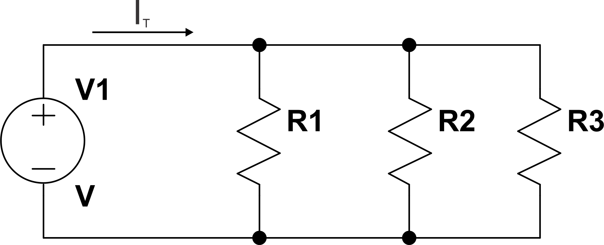

# 1.1

R1=5k, R2=10k

a) Em série:

b) Em paralelo:

# 1.2

# 1.3
Eu não entendi muito bem o que o enunciado da questão pede, eu entendi que é prá deduzir as equações que permitem calcular o valor de resistência total para circuitos série e paralelo. Se for isso, então vamos lá:

## a) Série
Partindo de um circuito como abaixo:

Pela lei de Ohm, V = R.I, e R = V/I. A resistência total do circuito, que é a resistência que a fonte V1 "enxerga", é a razão da tensão da fonte pela corrente total (It) do circuito.

Pela lei de Kirchhoff, a soma da queda de tensão nos resistores será igual à tensão da fonte.

Como no circuito série a corrente é a mesma em todos os componentes, podemos reescrever como sendo:

## b) Paralelo

Partindo do circuito abaixo:

Neste caso, a tensão em todos os resistores será igual, que é a tensão da fonte V. A corrente It será a soma das correntes nos resistores:

# 1.4
Pelo jeito ele pediu para fazer o que fiz em 1.3 b, então sei lá...

# 1.5

Dados: R=1k com 0,25W de potência máxima.
Ao conectar numa fonte de 15V, a potência dissipada será:

Se conectar um resistor em série com este resistor, a corrente será menor, consequentemente a potência será menor. Se conectar em paralelo, a tensão e corrente sobre o resistor continuará igual. Desta maneira, não é possível fazer com que a potência dissipada sobre o resistor seja maior que 0,225W, tendo uma única fonte de 15V.

# 1.6

Para a potência e tensão informados, a corrente será de:

a)
